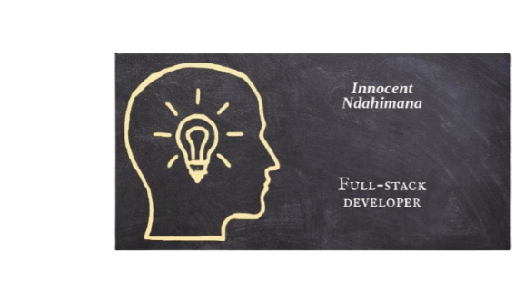

<a name="readme-top"></a>

<div align="center">
    <br/>

# Blog_app



</div>
<!-- TABLE OF CONTENTS -->

## 📗 Table of Contents

- [📖 Blog app ](#-blog-app-)
  - [🛠 Built With ](#-built-with-)
    - [Tech Stack ](#tech-stack-)
    - [Key Features ](#key-features-)
  - [💻 Getting Started ](#-getting-started-)
    - [Prerequisites](#prerequisites)
    - [Setup](#setup)
    - [Install](#install)
    - [Usage](#usage)
  - [👥 Author ](#-author-)
  - [🔭 Future Features ](#-future-features-)
  - [🤝 Contributing ](#-contributing-)
  - [⭐️ Show your support ](#️-show-your-support-)
  - [🙏 Acknowledgments ](#-acknowledgments-)
  - [📝 License ](#-license-)

<!-- PROJECT DESCRIPTION -->

# 📖 Blog app <a name="about-project"></a>

**Blog app** Is rails blog websites that enables user to post, comment on, and like the post. 

## 🛠 Built With <a name="built-with"></a>

### Tech Stack <a name="tech-stack"></a>

<details>
  <summary>Server</summary>
    <li><a href="https://www.ruby-lang.org/en/">Ruby</a></li>
    <li><a href="https://rubyonrails.org/">Rails</a></li>
</details>
<details>
  <summary>Database</summary>
    <li><a href="https://www.postgresql.org/">Postgres</a></li>
</details>

<!-- Features -->

### Key Features <a name="key-features"></a>

- **Create models**
- **Validations and Model specs.**
- **Processing data in models.**
- **Controllers.**
- **Controllers specs.**

<p align="right">(<a href="#readme-top">back to top</a>)</p>

<!-- LIVE DEMO

## 🚀 Live Demo <a name="live-demo"></a>

- [Live Demo Link](https://stock-wise.vercel.app/)

<p align="right">(<a href="#readme-top">back to top</a>)</p> -->

<!-- GETTING STARTED -->

## 💻 Getting Started <a name="getting-started"></a>

To get a local copy up and running, follow these steps.

### Prerequisites

In order to run this project you need:

```
    ruby >= 3.2.0
    rails >= 7.0.8
    postgres >- 15.3
```

### Setup

Clone this repository to your desired folder:

```bash
  git https://github.com/Innocent259/blog-app.git
```

You need to setup database for these project

```
  development = bloggApp_app_development
  test        = bloggie_app_test
  production  = Bloggie_app_production
```

or you can use your own database and change the ```config/database.yml```

```yml
default: &default
  adapter: postgresql
  encoding: unicode
  pool: <%= ENV.fetch("RAILS_MAX_THREADS") { 5 } %>

development:
  <<: *default
  database: blog_app_development
  username: your_username
  password: your_password
test:
  <<: *default
  database: blog_app_test
  username: your_username
  password: your_password

production:
  <<: *default
  database: blog_app_production
  username: blog_app
  password: <%= ENV["BLOG_APP_DATABASE_PASSWORD"] %>

```

### Install

Install this project with:

```bash
  cd Blog-app
  bundle install
```

it will install the required gemfile for running the project

### Usage

to use this project:

```ruby
   bin/rails server
```

it will run the the server on ```localhost:3000```

<!-- ### Test

to run test in these this project:

```ruby
   rspec
```

it will run the all the unit test of these project

 -->


<p align="right">(<a href="#readme-top">back to top</a>)</p>


## 👥 Author <a name="author"></a>

 👤 **Innocent Ndahimana**

- GitHub: [@innocent259](https://github.com/Innocent259)
- Twitter: [@innocentndahimana](https://www.linkedin.com/in/innocent259/)
- LinkedIn: [@innocentndahimana](https://twitter.com/ndahimana259)

<p align="right">(<a href="#readme-top">back to top</a>)</p>

<!-- FUTURE FEATURES -->

## 🔭 Future Features <a name="future-features"></a>

- **Views.**
- **Forms.**
- **Integration specs for Views and fixing n+1 problems.**
- **Add Devise.**
- **Add authorization rules.**
- **Add API endpoints.**
- **API documentation.**


<p align="right">(<a href="#readme-top">back to top</a>)</p>

<!-- CONTRIBUTING -->

## 🤝 Contributing <a name="contributing"></a>

Contributions, issues, and feature requests are welcome!

<p align="right">(<a href="#readme-top">back to top</a>)</p>

<!-- SUPPORT -->

## ⭐️ Show your support <a name="support"></a>

If you like this project you can share this project to give it a ⭐️

<p align="right">(<a href="#readme-top">back to top</a>)</p>

<!-- ACKNOWLEDGEMENTS -->

## 🙏 Acknowledgments <a name="acknowledgements"></a>

I would like to thank microverse for this project

<p align="right">(<a href="#readme-top">back to top</a>)</p>

<!-- LICENSE -->

## 📝 License <a name="license"></a>

This project is [MIT](./LICENSE) licensed.

<p align="right">(<a href="#readme-top">back to top</a>)</p>
